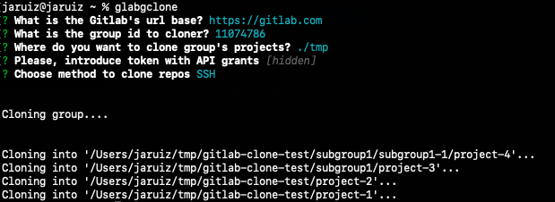

# Gitlab Group Clone Tool

This project provides a tool to clone all the projects within a group, identified by its id.

## Features

- Clone every project associated to a group and its subgroups
- If some project is already cloned in the target folder, this tool will perform a "git pull" action

<br />

## Install

### Global
To install this tool, execute this command:

```
npm i gitlab-group-clone -g
```

<br />


### Local
If you don't want to install the tool globally, clone the project from Github and execute it from the project folder.
To clone the project, execute:

```
git clone https://github.com/jaruizes/gitlab-group-clone.git
```

<br />


Then, execute:

```
cd gitlab-group-clone
npm i
```

<br />


## Usage

### Requirements
To use this tool you need:

- **Gitlab Personal Access Token**: this tool asks you for this kind of token but it will never store it. The tool uses this token 
  to call to Gitlab API. To create this token, just go to **Preferences -> Access Tokens** in the Gitlab web application. Then,
  you must create a Token with "API" grants:

  

- **Be allowed to clone projects in Gitlab (private projects)**: this tool isn't going to ask you for any password or ssh keys to clone private
  projects. It assumes that you have already configured in your system the credentials to clone private projects in Gitlab.

<br />

### Executing the tool
This tool is so easy to use because it's a CLI. The CLI asks you the following questions:

- Gitlab base URL, for instance: https://gitlab.com/
- GroupId to clone: this id is an integer. It's not the group name.
- Destination path: path where the group will be cloned
- Method: ssh / http
- Token: a personal access token with API grants.

<br />

### Globally
If you installed the tool [globally](#global), execute (from any folder):

```
glabgclone
```

<br />

And the tool will begin to ask for the necessary data. For instance:



<br />

### Locally
If you install the tool [locally](#local), go to the folder where you cloned the project and execute:

```
npm start
```

<br />

#### Group ID

The group ID is the number located below the group name:


Just copy this number and paste it when the CLI asks for it.
